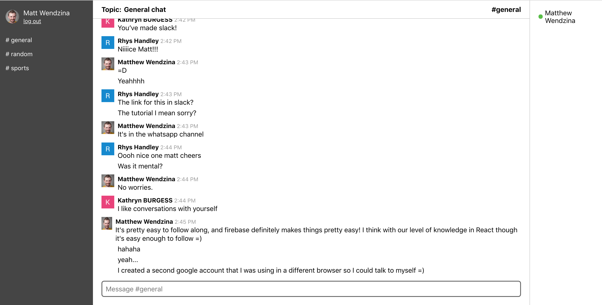

# Project Name
Chat app using React and Firebase. 

## Table of contents
- [Project Name](#project-name)
  - [Table of contents](#table-of-contents)
  - [General info](#general-info)
  - [Screenshots](#screenshots)
  - [Technologies](#technologies)
  - [Setup](#setup)
  - [Features](#features)
  - [Status](#status)
  - [Inspiration](#inspiration)
  - [Contact](#contact)

## General info
This is a project I completed following a course by Ryan Florence. This was a way of developing skill using Firebase and improving my use of React Hooks. 

## Screenshots


## Technologies
* React  
* Firebase

## Setup
To run this project, install it locally using npm:

```
$ cd ../lorem
$ npm install
$ npm start
```

## Features
List of features ready
* Makes use of Firebase Authentication
* Realtime Firebase Database tracks users online


## Status
Project is: _in progress_

## Inspiration
Ryan Florence at Reach.tech

## Contact
Created by [@mattwendzina]() - feel free to contact me!
